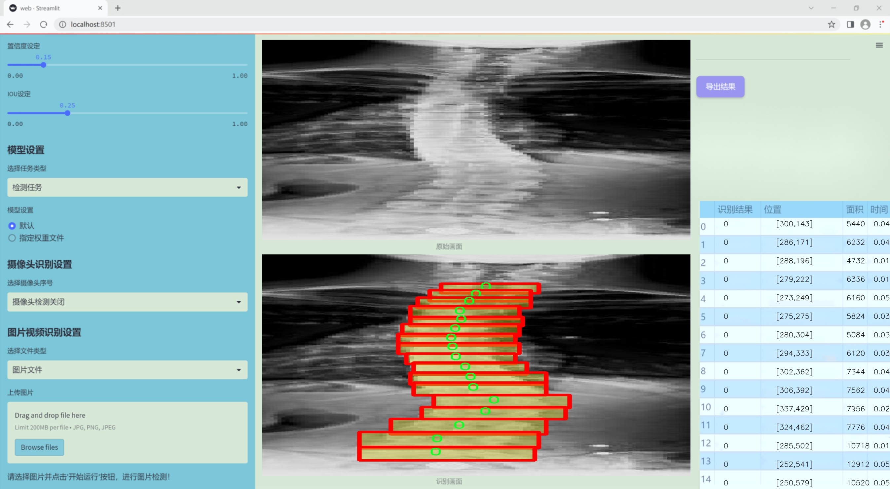
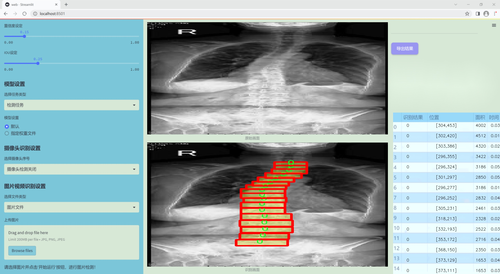
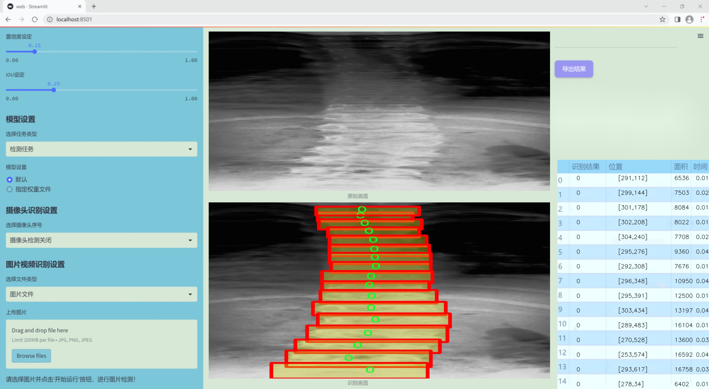
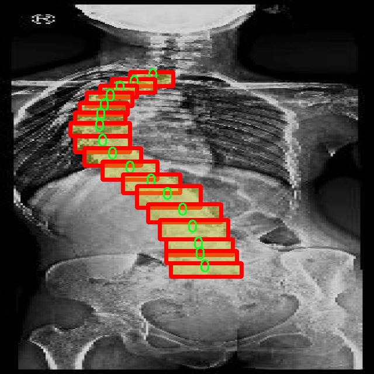
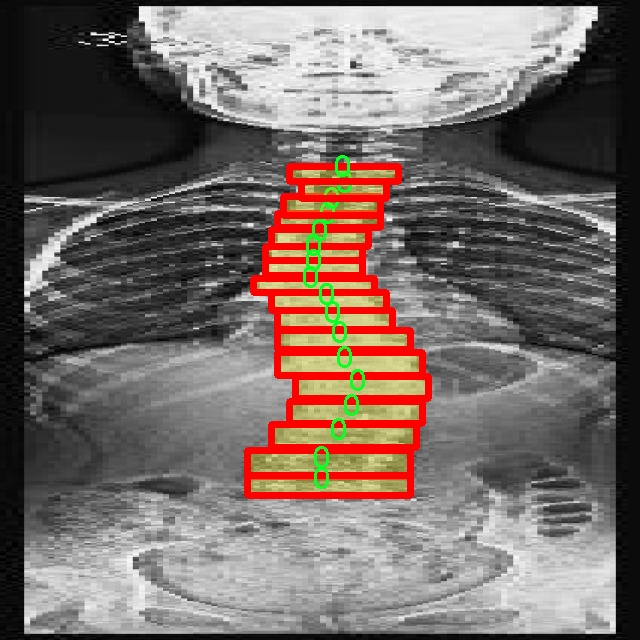
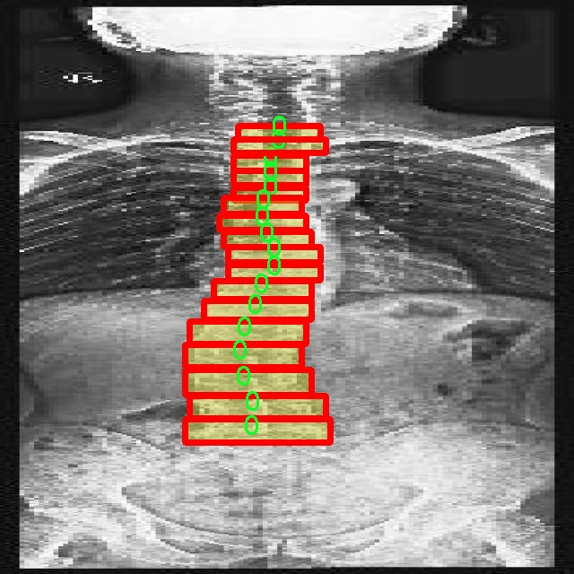
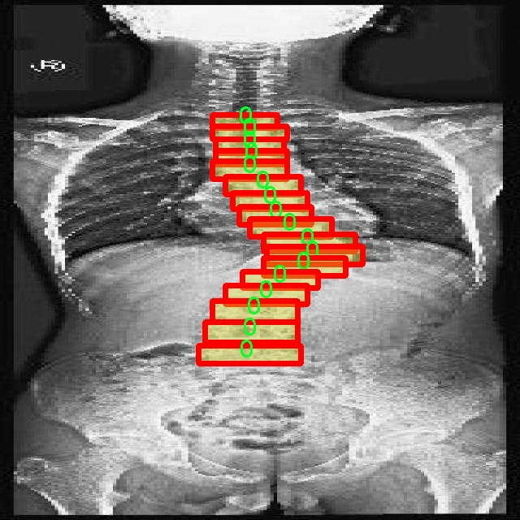

### 1.背景意义

研究背景与意义

脊椎作为人类和许多动物的关键结构，不仅在运动中起着支撑作用，还在保护脊髓和神经系统方面具有重要意义。随着医学影像技术的快速发展，脊椎疾病的早期诊断和治疗变得愈发重要。传统的脊椎影像分析方法往往依赖于人工标注和经验判断，效率低下且容易受到主观因素的影响。因此，基于计算机视觉的自动化脊椎实例分割技术应运而生，成为提高脊椎疾病诊断精度和效率的重要手段。

本研究旨在开发一种基于改进YOLOv11的脊椎实例分割系统，以实现对脊椎影像的自动化分析。该系统将利用一个包含2300幅图像的数据集，数据集中包含两个类别的标注，主要针对脊椎的实例进行分割。通过对数据集的深入分析与处理，我们将应用YOLOv11模型进行训练，以提高脊椎实例分割的准确性和实时性。YOLOv11作为一种先进的目标检测算法，具有较高的检测速度和精度，适合在医疗影像分析中应用。

在实际应用中，脊椎实例分割系统不仅可以帮助医生快速识别和定位脊椎病变，还可以为后续的治疗方案提供数据支持。此外，随着深度学习技术的不断进步，基于改进YOLOv11的实例分割方法将为脊椎影像分析提供新的思路和技术手段，推动医学影像学的发展。因此，本研究具有重要的学术价值和实际应用意义，能够为脊椎疾病的早期诊断和治疗提供有效的技术支持。

### 2.视频效果

[2.1 视频效果](https://www.bilibili.com/video/BV1HxqqY3EaJ/)

### 3.图片效果







##### [项目涉及的源码数据来源链接](https://kdocs.cn/l/cszuIiCKVNis)**

注意：本项目提供训练的数据集和训练教程,由于版本持续更新,暂不提供权重文件（best.pt）,请按照6.训练教程进行训练后实现上图演示的效果。

### 4.数据集信息

##### 4.1 本项目数据集类别数＆类别名

nc: 2
names: ['0', 'object']


该项目为【图像分割】数据集，请在【训练教程和Web端加载模型教程（第三步）】这一步的时候按照【图像分割】部分的教程来训练

##### 4.2 本项目数据集信息介绍

本项目数据集信息介绍

本项目所使用的数据集以“DB_E”为主题，旨在为改进YOLOv11的脊椎实例分割系统提供强有力的支持。该数据集包含了两类主要的对象，分别为“0”和“object”，共计两个类别。这种简洁的类别设置不仅有助于提高模型的训练效率，也使得模型在处理脊椎实例分割任务时能够更加专注于关键特征的提取与识别。

数据集中的图像经过精心挑选与标注，确保涵盖了脊椎的多种形态与结构特征。每一幅图像都经过专业人员的审核与标注，确保数据的准确性与可靠性。这些图像不仅展示了脊椎的不同解剖位置，还涵盖了多种拍摄角度与光照条件，以增强模型的泛化能力。数据集的多样性使得训练出的模型能够在实际应用中更好地适应不同的场景与条件，从而提升脊椎实例分割的准确性与鲁棒性。

此外，数据集的设计考虑到了脊椎实例分割的特定需求，确保了标注的细致与全面。通过对脊椎的精确标注，模型能够学习到更为细腻的特征，从而在实例分割任务中表现出色。数据集的构建不仅为模型的训练提供了丰富的样本，也为后续的模型评估与优化奠定了坚实的基础。

综上所述，DB_E数据集的构建与应用将为改进YOLOv11的脊椎实例分割系统提供强有力的支持，助力于实现更高效、更精准的脊椎医学影像分析。通过对该数据集的深入研究与应用，期望能够推动脊椎实例分割技术的发展，为相关领域的研究与临床应用提供重要的参考与借鉴。










### 5.全套项目环境部署视频教程（零基础手把手教学）

[5.1 所需软件PyCharm和Anaconda安装教程（第一步）](https://www.bilibili.com/video/BV1BoC1YCEKi/?spm_id_from=333.999.0.0&vd_source=bc9aec86d164b67a7004b996143742dc)


[5.2 安装Python虚拟环境创建和依赖库安装视频教程（第二步）](https://www.bilibili.com/video/BV1ZoC1YCEBw?spm_id_from=333.788.videopod.sections&vd_source=bc9aec86d164b67a7004b996143742dc)

### 6.改进YOLOv11训练教程和Web_UI前端加载模型教程（零基础手把手教学）

[6.1 改进YOLOv11训练教程和Web_UI前端加载模型教程（第三步）](https://www.bilibili.com/video/BV1BoC1YCEhR?spm_id_from=333.788.videopod.sections&vd_source=bc9aec86d164b67a7004b996143742dc)


按照上面的训练视频教程链接加载项目提供的数据集，运行train.py即可开始训练



     Epoch   gpu_mem       box       obj       cls    labels  img_size
     1/200     20.8G   0.01576   0.01955  0.007536        22      1280: 100%|██████████| 849/849 [14:42<00:00,  1.04s/it]
               Class     Images     Labels          P          R     mAP@.5 mAP@.5:.95: 100%|██████████| 213/213 [01:14<00:00,  2.87it/s]
                 all       3395      17314      0.994      0.957      0.0957      0.0843

     Epoch   gpu_mem       box       obj       cls    labels  img_size
     2/200     20.8G   0.01578   0.01923  0.007006        22      1280: 100%|██████████| 849/849 [14:44<00:00,  1.04s/it]
               Class     Images     Labels          P          R     mAP@.5 mAP@.5:.95: 100%|██████████| 213/213 [01:12<00:00,  2.95it/s]
                 all       3395      17314      0.996      0.956      0.0957      0.0845

     Epoch   gpu_mem       box       obj       cls    labels  img_size
     3/200     20.8G   0.01561    0.0191  0.006895        27      1280: 100%|██████████| 849/849 [10:56<00:00,  1.29it/s]
               Class     Images     Labels          P          R     mAP@.5 mAP@.5:.95: 100%|███████   | 187/213 [00:52<00:00,  4.04it/s]
                 all       3395      17314      0.996      0.957      0.0957      0.0845


###### [项目数据集下载链接](https://kdocs.cn/l/cszuIiCKVNis)

### 7.原始YOLOv11算法讲解


ultralytics发布了最新的作品YOLOv11，这一次YOLOv11的变化相对于ultralytics公司的上一代作品YOLOv8变化不是很大的（YOLOv9、YOLOv10均不是ultralytics公司作品），其中改变的位置涉及到C2f变为C3K2，在SPPF后面加了一层类似于注意力机制的C2PSA，还有一个变化大家从yaml文件是看不出来的就是它的检测头内部替换了两个DWConv，以及模型的深度和宽度参数进行了大幅度调整，但是在损失函数方面就没有变化还是采用的CIoU作为边界框回归损失，下面带大家深入理解一下ultralytics最新作品YOLOv11的创新点。

**下图为最近的YOLO系列发布时间线！**


* * *

###### YOLOv11和YOLOv8对比

在YOLOYOLOv5，YOLOv8，和YOLOv11是ultralytics公司作品（ultralytics出品必属精品），下面用一张图片从yaml文件来带大家对比一下YOLOv8和YOLOv11的区别，配置文件变得内容比较少大家可以看一卡，左侧为YOLOv8右侧为YOLOv11，不同的点我用黑线标注了出来。


* * *

###### YOLOv11的网络结构解析

下面的图片为YOLOv11的网络结构图。


**其中主要创新点可以总结如下- > **

* * *

1\.
提出C3k2机制，其中C3k2有参数为c3k，其中在网络的浅层c3k设置为False（下图中可以看到c3k2第二个参数被设置为False，就是对应的c3k参数）。


此时所谓的C3k2就相当于YOLOv8中的C2f，其网络结构为一致的，其中的C3k机制的网络结构图如下图所示
**（为什么叫C3k2，我个人理解是因为C3k的调用时C3k其中的参数N固定设置为2的原因，个人理解不一定对** ）。


* * *

2\.
第二个创新点是提出C2PSA机制，这是一个C2（C2f的前身）机制内部嵌入了一个多头注意力机制，在这个过程中我还发现作者尝试了C2fPSA机制但是估计效果不如C2PSA，有的时候机制有没有效果理论上真的很难解释通，下图为C2PSA机制的原理图，仔细观察把Attention哪里去掉则C2PSA机制就变为了C2所以我上面说C2PSA就是C2里面嵌入了一个PSA机制。


* * *

3\.
第三个创新点可以说是原先的解耦头中的分类检测头增加了两个DWConv，具体的对比大家可以看下面两个图下面的是YOLOv11的解耦头，上面的是YOLOv8的解耦头.


我们上面看到了在分类检测头中YOLOv11插入了两个DWConv这样的做法可以大幅度减少参数量和计算量（原先两个普通的Conv大家要注意到卷积和是由3变为了1的，这是形成了两个深度可分离Conv），大家可能不太理解为什么加入了两个DWConv还能够减少计算量，以及什么是深度可分离Conv，下面我来解释一下。

> **`DWConv` 代表 Depthwise
> Convolution（深度卷积）**，是一种在卷积神经网络中常用的高效卷积操作。它主要用于减少计算复杂度和参数量，尤其在移动端或轻量化网络（如
> MobileNet）中十分常见。
>
> **1\. 标准卷积的计算过程**
>
> 在标准卷积操作中，对于一个输入张量（通常是一个多通道的特征图），卷积核的尺寸是 `(h, w, C_in)`，其中 `h` 和 `w`
> 是卷积核的空间尺寸，`C_in`
> 是输入通道的数量。而卷积核与输入张量做的是完整的卷积运算，每个输出通道都与所有输入通道相连并参与卷积操作，导致计算量比较大。
>
> 标准卷积的计算过程是这样的：
>
>   * 每个输出通道是所有输入通道的组合（加权求和），卷积核在每个位置都会计算与所有输入通道的点积。
>   * 假设有 `C_in` 个输入通道和 `C_out` 个输出通道，那么卷积核的总参数量是 `C_in * C_out * h * w`。
>

>
> 2\. **Depthwise Convolution（DWConv）**
>
> 与标准卷积不同， **深度卷积** 将输入的每个通道单独处理，即 **每个通道都有自己的卷积核进行卷积**
> ，不与其他通道进行交互。它可以被看作是标准卷积的一部分，专注于空间维度上的卷积运算。
>
> **深度卷积的计算过程：**
>
>   * 假设输入张量有 `C_in` 个通道，每个通道会使用一个 `h × w`
> 的卷积核进行卷积操作。这个过程称为“深度卷积”，因为每个通道独立进行卷积运算。
>   * 输出的通道数与输入通道数一致，每个输出通道只和对应的输入通道进行卷积，没有跨通道的组合。
>   * 参数量和计算量相比标准卷积大大减少，卷积核的参数量是 `C_in * h * w`。
>

>
> **深度卷积的优点：**
>
>   1. **计算效率高** ：相对于标准卷积，深度卷积显著减少了计算量。它只处理空间维度上的卷积，不再处理通道间的卷积。
>   2.  **参数量减少** ：由于每个卷积核只对单个通道进行卷积，参数量大幅减少。例如，标准卷积的参数量为 `C_in * C_out * h *
> w`，而深度卷积的参数量为 `C_in * h * w`。
>   3.  **结合点卷积可提升效果** ：为了弥补深度卷积缺乏跨通道信息整合的问题，通常深度卷积后会配合 `1x1` 的点卷积（Pointwise
> Convolution）使用，通过 `1x1` 的卷积核整合跨通道的信息。这种组合被称为 **深度可分离卷积** （Depthwise
> Separable Convolution） | **这也是我们本文YOLOv11中的做法** 。
>

>
> 3\. **深度卷积与标准卷积的区别**
>
> 操作类型| 卷积核大小| 输入通道数| 输出通道数| 参数量  
> ---|---|---|---|---  
> 标准卷积| `h × w`| `C_in`| `C_out`| `C_in * C_out * h * w`  
> 深度卷积（DWConv）| `h × w`| `C_in`| `C_in`| `C_in * h * w`  
>  
> 可以看出，深度卷积在相同的卷积核大小下，参数量减少了约 `C_out` 倍
> （细心的人可以发现用最新版本的ultralytics仓库运行YOLOv8参数量相比于之前的YOLOv8以及大幅度减少了这就是因为检测头改了的原因但是名字还是Detect，所以如果你想继续用YOLOv8发表论文做实验那么不要更新最近的ultralytics仓库）。
>
> **4\. 深度可分离卷积 (Depthwise Separable Convolution)**
>
> 深度卷积常与 `1x1` 的点卷积配合使用，这称为深度可分离卷积。其过程如下：
>
>   1. 先对输入张量进行深度卷积，对每个通道独立进行空间卷积。
>   2. 然后通过 `1x1` 点卷积，对通道维度进行混合，整合不同通道的信息。
>

>
> 这样既可以保证计算量的减少，又可以保持跨通道的信息流动。
>
> 5\. **总结**
>
> `DWConv` 是一种高效的卷积方式，通过单独处理每个通道来减少计算量，结合 `1x1`
> 的点卷积，形成深度可分离卷积，可以在保持网络性能的同时极大地减少模型的计算复杂度和参数量。

**看到这里大家应该明白了为什么加入了两个DWConv还能减少参数量以及YOLOv11的检测头创新点在哪里。**

* * *

##### YOLOv11和YOLOv8还有一个不同的点就是其各个版本的模型（N - S - M- L - X）网络深度和宽度变了


可以看到在深度（depth）和宽度
（width）两个地方YOLOv8和YOLOv11是基本上完全不同了，这里我理解这么做的含义就是模型网络变小了，所以需要加深一些模型的放缩倍数来弥补模型之前丧失的能力从而来达到一个平衡。

> **本章总结：**
> YOLOv11的改进点其实并不多更多的都是一些小的结构上的创新，相对于之前的YOLOv5到YOLOv8的创新，其实YOLOv11的创新点不算多，但是其是ultralytics公司的出品，同时ultralytics仓库的使用量是非常多的（不像YOLOv9和YOLOv10）所以在未来的很长一段时间内其实YOLO系列估计不会再更新了，YOLOv11作为最新的SOTA肯定是十分适合大家来发表论文和创新的。
>

### 8.200+种全套改进YOLOV11创新点原理讲解

#### 8.1 200+种全套改进YOLOV11创新点原理讲解大全

由于篇幅限制，每个创新点的具体原理讲解就不全部展开，具体见下列网址中的改进模块对应项目的技术原理博客网址【Blog】（创新点均为模块化搭建，原理适配YOLOv5~YOLOv11等各种版本）

[改进模块技术原理博客【Blog】网址链接](https://gitee.com/qunmasj/good)


#### 8.2 精选部分改进YOLOV11创新点原理讲解

###### 这里节选部分改进创新点展开原理讲解(完整的改进原理见上图和[改进模块技术原理博客链接](https://gitee.com/qunmasj/good)【如果此小节的图加载失败可以通过CSDN或者Github搜索该博客的标题访问原始博客，原始博客图片显示正常】

### 高效网络架构 CloAtt简介
众所周知，自从 ViTs 提出后，Transformer 基本横扫各大 CV 主流任务，包括视觉识别、目标检测和语义分割等。然而，一个比较棘手的问题就是这个架构参数量和计算量太大，所以一直被广受诟病。因此，后续有不少工作都是朝着这个方向去改进，例如 Swin-Transformer 在局部非重叠窗口中进行注意力计算，而 PVT 中则是使用平均池化来合并 token 以进一步压缩耗时。然而，这些 ViTs 由于其参数量太大以及高 FLOPs 并不适合部署到移动设备。如果我们直接缩小到适合移动设备的尺寸时，它们的性能又会显著降低。


#### MobileViT
因此，出现了不少工作聚焦于探索轻量级的视觉变换器，使 ViTs 适用于移动设备，CVHub 此前也介绍过不少的工作，大家有兴趣可以翻阅历史文章读读。例如，苹果团队提出的 MobileViT 研究了如何将 CNN 与 Transformer 相结合，而另一个工作 MobileFormer 则将轻量级的 MobileNet 与 Transformer 进行融合。此外，最新提出的 EdgeViT 提出了一个局部-全局-局部模块来聚合信息。以上工作的目标都是设计具有高性能、较少参数和低 FLOPs 的移动端友好型模型。


#### EdgeViT
然而，作者从频域编码的角度认为，在现有的轻量级模型中，大多数方法只关注设计稀疏注意力，以有效地处理低频全局信息，而使用相对简单的方法处理高频局部信息。具体而言，大多数模型如 EdgeViT 和 MobileViT，只是简单使用原始卷积提取局部表示，这些方法仅使用卷积中的全局共享权重处理高频本地信息。其他方法，如 LVT ，则是首先将标记展开到窗口中，然后使用窗口内的注意力获得高频信息。这些方法仅使用特定于每个 Token 的上下文感知权重进行局部感知。


#### LVT
虽然上述轻量级模型在多个数据集上取得了良好的结果，但没有一种方法尝试设计更有效的方法，即利用共享和上下文感知权重的优势来处理高频局部信息。基于共享权重的方法，如传统的卷积神经网络，具有平移等变性的特征。与它们不同，基于上下文感知权重的方法，如 LVT 和 NAT，具有可以随输入内容变化的权重。这两种类型的权重在局部感知中都有自己的优势。
#### NAT


受该博客的启发，本文设计了一种轻量级视觉变换器——CloAtt，其利用了上下文感知的局部增强。特别地，CloAtt 采用了双分支设计结构。
#### 局部分支
在局部分支中，本文引入了一个精心设计的 AttnConv，一种简单而有效的卷积操作符，它采用了注意力机制的风格。所提出的 AttnConv 有效地融合了共享权重和上下文感知权重，以聚合高频的局部信息。具体地，AttnConv 首先使用深度卷积（DWconv）提取局部表示，其中 DWconv 具有共享权重。然后，其使用上下文感知权重来增强局部特征。与 Non-Local 等生成上下文感知权重的方法不同，AttnConv 使用门控机制生成上下文感知权重，引入了比常用的注意力机制更强的非线性。此外，AttnConv 将卷积算子应用于 Query 和 Key 以聚合局部信息，然后计算 Q 和 K 的哈达玛积，并对结果进行一系列线性或非线性变换，生成范围在 [-1,1] 之间的上下文感知权重。值得注意的是，AttnConv 继承了卷积的平移等变性，因为它的所有操作都基于卷积。
#### 全局分支
在全局分支中则使用了传统的注意力机制，但对 K 和 V 进行了下采样以减少计算量，从而捕捉低频全局信息。最后，CloFormer 通过简单的方法将局部分支和全局分支的输出进行融合，从而使模型能够同时捕捉高频和低频信息。总的来说，CloFormer 的设计能够同时发挥共享权重和上下文感知权重的优势，提高其局部感知的能力，使其在图像分类、物体检测和语义分割等多个视觉任务上均取得了优异的性能。
如上图2所示，CloFormer 共包含一个卷积主干和四个 stage，每个 stage you Clo 模块 和 ConvFFN 组合而成的模块堆叠而成 。具体得，首先将输入图像通过卷积主干传递，以获取 token 表示。该主干由四个卷积组成，每个卷积的步长依次为2、2、1和1。接下来，tokens 经历四个 Clo 块和 ConvFFN 阶段，以提取分层特征。最后，再利用全局平均池化和全连接层生成预测结果。可以看出，整个架构非常简洁，支持即插即用！


#### ConvFFN
为了将局部信息融入 FFN 过程中，本文采用 ConvFFN 替换了常用的 FFN。ConvFFN 和常用的 FFN 的主要区别在于，ConvFFN 在 GELU 激活函数之后使用了深度卷积（DWconv），从而使 ConvFFN 能够聚合局部信息。由于DWconv 的存在，可以直接在 ConvFFN 中进行下采样而不需要引入 PatchMerge 模块。CloFormer 使用了两种ConvFFN。第一种是在阶段内的 ConvFFN，它直接利用跳跃连接。另一种是连接两个阶段的 ConvFFN，主要用于下采样操作。
#### Clo block
CloFormer 中的 Clo块 是非常关键的组件。每个 Clo 块由一个局部分支和一个全局分支组成。在全局分支中，我们首先下采样 K 和 V，然后对 Q、K 和 V 进行标准的 attention 操作，以提取低频全局信息。
虽然全局分支的设计能够有效减少注意力机制所需的浮点运算次数，并且能够获得全局的感受野。然而，它在处理高频局部信息方面的能力不足。为了解决这个问题，CloFormer 引入了局部分支，并使用 AttnConv 对高频局部信息进行处理。AttnConv 可以融合共享权重和上下文感知权重，能够更好地处理高频局部信息。因此，CloFormer 结合了全局和局部的优势来提高图像分类性能。下面我们重点讲下 AttnConv 。
#### AttnConv
AttnConv 是一个关键模块，使得所提模型能够获得高性能。它结合了一些标准的 attention 操作。具体而言，在AttnConv 中，我们首先进行线性变换以获得 Q、K和V。在进行线性变换之后，我们再对 V 进行共享权重的局部特征聚合。然后，基于处理后的 V 和 Q ，K 进行上下文感知的局部增强。具体流程可对照流程图理解，我们可以将其拆解成三个步骤。
#### Local Feature Aggregation
为了简单起见，本文直接使用一个简单的深度卷积（DWconv）来对 V 进行局部信息聚合。
#### Context-aware Local Enhancement
在将具有共享权重的局部信息整合到 V 中后，我们结合 Q 和 K 生成上下文感知权重。值得注意的是，我们使用了与局部自注意力不同的方法，该方法更加简洁。具体而言，我们首先使用两个 DWconv 对 Q 和 K 分别进行局部信息聚合。然后，我们计算 Q 和 K 的 Hadamard 乘积，并对结果进行一系列转换，以获取在 -1 到 1 之间的上下文感知权重。最后，我们使用生成的权重来增强局部特征。
#### Fusion with Global Branch
在整个 CloFormer 中，我们使用一种简单直接的方法来将局部分支和全局分支的输出进行融合。具体而言，本文是通过将这两个输出在通道维度上进行直接拼接，然后再通过一个 FC 层聚合这些特征并结合残差输出。
最后，上图展示了三种不同的方法。相比于传统卷积，AttnConv 中的上下文感知权重使得模型能够更好地适应输入内容。相比于局部自注意力机制，引入共享权重使得模型能够更好地处理高频信息，从而提高性能。此外，生成上下文感知权重的方法引入了更强的非线性性，也提高了性能。需要注意的是，AttnConv 中的所有操作都基于卷积，保持了卷积的平移等变性特性。


### 9.系统功能展示

图9.1.系统支持检测结果表格显示

  图9.2.系统支持置信度和IOU阈值手动调节

  图9.3.系统支持自定义加载权重文件best.pt(需要你通过步骤5中训练获得)

  图9.4.系统支持摄像头实时识别

  图9.5.系统支持图片识别

  图9.6.系统支持视频识别

  图9.7.系统支持识别结果文件自动保存

  图9.8.系统支持Excel导出检测结果数据


### 10. YOLOv11核心改进源码讲解

#### 10.1 val.py

以下是对给定代码的核心部分进行提炼和详细注释的结果：

```python
import os
import torch
from ultralytics.data import build_dataloader, build_yolo_dataset, converter
from ultralytics.engine.validator import BaseValidator
from ultralytics.utils import LOGGER, ops
from ultralytics.utils.metrics import ConfusionMatrix, DetMetrics, box_iou

class DetectionValidator(BaseValidator):
    """
    继承自BaseValidator类，用于基于检测模型的验证。
    """

    def __init__(self, dataloader=None, save_dir=None, pbar=None, args=None, _callbacks=None):
        """初始化检测模型所需的变量和设置。"""
        super().__init__(dataloader, save_dir, pbar, args, _callbacks)
        self.metrics = DetMetrics(save_dir=self.save_dir)  # 初始化检测指标
        self.iouv = torch.linspace(0.5, 0.95, 10)  # 定义IoU向量用于mAP计算

    def preprocess(self, batch):
        """对YOLO训练的图像批次进行预处理。"""
        batch["img"] = batch["img"].to(self.device, non_blocking=True)  # 将图像转移到设备上
        batch["img"] = batch["img"].float() / 255  # 将图像归一化到[0, 1]
        for k in ["batch_idx", "cls", "bboxes"]:
            batch[k] = batch[k].to(self.device)  # 将其他数据转移到设备上
        return batch

    def postprocess(self, preds):
        """对预测输出应用非极大值抑制（NMS）。"""
        return ops.non_max_suppression(
            preds,
            self.args.conf,
            self.args.iou,
            multi_label=True,
            max_det=self.args.max_det,
        )

    def update_metrics(self, preds, batch):
        """更新检测指标。"""
        for si, pred in enumerate(preds):
            npr = len(pred)  # 当前批次的预测数量
            pbatch = self._prepare_batch(si, batch)  # 准备当前批次的真实标签
            cls, bbox = pbatch.pop("cls"), pbatch.pop("bbox")  # 获取真实类别和边界框

            if npr == 0:  # 如果没有预测
                continue

            predn = self._prepare_pred(pred, pbatch)  # 准备预测数据
            # 计算TP（真正例）等指标
            stat = self._process_batch(predn, bbox, cls)
            # 更新统计信息
            for k in self.stats.keys():
                self.stats[k].append(stat[k])

    def get_stats(self):
        """返回指标统计信息和结果字典。"""
        stats = {k: torch.cat(v, 0).cpu().numpy() for k, v in self.stats.items()}  # 转换为numpy数组
        if len(stats) and stats["tp"].any():
            self.metrics.process(**stats)  # 处理指标
        return self.metrics.results_dict  # 返回结果字典

    def build_dataset(self, img_path, mode="val", batch=None):
        """构建YOLO数据集。"""
        return build_yolo_dataset(self.args, img_path, batch, self.data, mode=mode)

    def get_dataloader(self, dataset_path, batch_size):
        """构建并返回数据加载器。"""
        dataset = self.build_dataset(dataset_path, batch=batch_size, mode="val")
        return build_dataloader(dataset, batch_size, self.args.workers, shuffle=False)

    def save_one_txt(self, predn, save_conf, shape, file):
        """将YOLO检测结果保存到txt文件中，格式为归一化坐标。"""
        gn = torch.tensor(shape)[[1, 0, 1, 0]]  # 归一化增益
        for *xyxy, conf, cls in predn.tolist():
            xywh = (ops.xyxy2xywh(torch.tensor(xyxy).view(1, 4)) / gn).view(-1).tolist()  # 转换为归一化的xywh格式
            line = (cls, *xywh, conf) if save_conf else (cls, *xywh)  # 保存格式
            with open(file, "a") as f:
                f.write(("%g " * len(line)).rstrip() % line + "\n")  # 写入文件

    def eval_json(self, stats):
        """评估YOLO输出的JSON格式并返回性能统计信息。"""
        if self.args.save_json and len(self.jdict):
            # 评估过程
            pass  # 省略具体实现
        return stats
```

### 代码核心部分说明：
1. **DetectionValidator类**：用于YOLO模型的验证，继承自`BaseValidator`。
2. **初始化方法**：设置一些重要的变量和指标。
3. **预处理方法**：将输入图像和标签数据转移到指定设备，并进行归一化处理。
4. **后处理方法**：应用非极大值抑制（NMS）来过滤预测结果。
5. **更新指标方法**：根据预测结果和真实标签更新检测指标。
6. **构建数据集和数据加载器**：用于加载验证数据。
7. **保存检测结果**：将检测结果保存为文本文件，便于后续分析。
8. **评估方法**：用于评估YOLO模型的输出，返回性能统计信息。

以上是对代码的核心部分提炼和详细注释，希望对你理解代码的功能和结构有所帮助。

这个文件 `val.py` 是一个用于YOLO（You Only Look Once）目标检测模型验证的Python脚本，主要实现了对模型性能的评估和统计。文件中包含了多个类和方法，下面对其主要内容进行逐步分析。

首先，文件导入了一些必要的库，包括操作系统相关的库、路径处理库、NumPy和PyTorch等。接着，导入了YOLO模型所需的各种工具和模块，如数据加载器、数据集构建器、验证器基类、日志记录器、度量标准等。

核心类 `DetectionValidator` 继承自 `BaseValidator`，专门用于基于检测模型的验证。该类的构造函数初始化了一些必要的变量和设置，包括目标类别的数量、是否为COCO数据集、类别映射、任务类型、度量标准等。`self.iouv` 定义了一个IoU（Intersection over Union）向量，用于计算mAP（mean Average Precision）。

在 `preprocess` 方法中，对输入的图像批次进行预处理，包括将图像数据转移到指定设备（如GPU），并进行归一化处理。还根据需要保存混合标签（hybrid labels）以便后续使用。

`init_metrics` 方法用于初始化YOLO模型的评估指标，判断是否为COCO数据集，并设置相关的类别映射和统计信息。

`get_desc` 方法返回一个格式化的字符串，用于总结YOLO模型的类别指标。

`postprocess` 方法应用非极大值抑制（Non-Maximum Suppression）来处理预测输出，以减少冗余的检测框。

`_prepare_batch` 和 `_prepare_pred` 方法分别用于准备验证的图像和注释数据，以及准备预测结果，确保它们在验证过程中可以正确匹配。

`update_metrics` 方法用于更新模型的评估指标，处理每个批次的预测结果和真实标签，计算正确预测的数量，并更新混淆矩阵。

`finalize_metrics` 方法用于设置最终的度量速度和混淆矩阵。

`get_stats` 方法返回模型的统计信息和结果字典，计算每个类别的目标数量。

`print_results` 方法打印训练或验证集的每个类别的指标，显示总的检测结果，并根据需要绘制混淆矩阵。

`_process_batch` 方法用于返回正确的预测矩阵，计算IoU并匹配预测与真实标签。

`build_dataset` 和 `get_dataloader` 方法用于构建YOLO数据集和返回数据加载器，确保数据能够以适当的批次大小加载。

`plot_val_samples` 和 `plot_predictions` 方法用于绘制验证图像样本和预测结果，便于可视化分析。

`save_one_txt` 和 `pred_to_json` 方法分别用于将YOLO检测结果保存为文本文件和COCO格式的JSON文件，以便后续分析和评估。

最后，`eval_json` 方法用于评估YOLO输出的JSON格式结果，并返回性能统计信息，使用pycocotools库计算mAP。

整体来看，这个文件实现了YOLO模型验证的完整流程，包括数据预处理、模型评估、结果统计和可视化等功能，为目标检测任务提供了重要的支持。

#### 10.2 RFAConv.py

以下是经过简化和注释的核心代码部分，主要包括 `RFAConv`、`RFCBAMConv` 和 `RFCAConv` 类。每个类的功能和主要步骤都有详细的中文注释。

```python
import torch
import torch.nn as nn
from einops import rearrange

class RFAConv(nn.Module):
    def __init__(self, in_channel, out_channel, kernel_size, stride=1):
        super().__init__()
        self.kernel_size = kernel_size

        # 用于获取权重的卷积层，首先进行平均池化，然后通过1x1卷积生成权重
        self.get_weight = nn.Sequential(
            nn.AvgPool2d(kernel_size=kernel_size, padding=kernel_size // 2, stride=stride),
            nn.Conv2d(in_channel, in_channel * (kernel_size ** 2), kernel_size=1, groups=in_channel, bias=False)
        )
        
        # 生成特征的卷积层，使用深度可分离卷积
        self.generate_feature = nn.Sequential(
            nn.Conv2d(in_channel, in_channel * (kernel_size ** 2), kernel_size=kernel_size, padding=kernel_size // 2, stride=stride, groups=in_channel, bias=False),
            nn.BatchNorm2d(in_channel * (kernel_size ** 2)),
            nn.ReLU()
        )
        
        # 最终的卷积层
        self.conv = nn.Conv2d(in_channel, out_channel, kernel_size=kernel_size, stride=kernel_size)

    def forward(self, x):
        b, c = x.shape[0:2]  # 获取批量大小和通道数
        weight = self.get_weight(x)  # 获取权重
        h, w = weight.shape[2:]  # 获取特征图的高和宽
        
        # 对权重进行softmax归一化
        weighted = weight.view(b, c, self.kernel_size ** 2, h, w).softmax(2)
        feature = self.generate_feature(x).view(b, c, self.kernel_size ** 2, h, w)  # 生成特征
        
        # 权重与特征相乘
        weighted_data = feature * weighted
        
        # 重新排列数据以适应卷积层的输入格式
        conv_data = rearrange(weighted_data, 'b c (n1 n2) h w -> b c (h n1) (w n2)', n1=self.kernel_size, n2=self.kernel_size)
        return self.conv(conv_data)  # 返回卷积结果


class RFCBAMConv(nn.Module):
    def __init__(self, in_channel, out_channel, kernel_size=3, stride=1):
        super().__init__()
        self.kernel_size = kernel_size
        
        # 生成特征的卷积层
        self.generate = nn.Sequential(
            nn.Conv2d(in_channel, in_channel * (kernel_size ** 2), kernel_size, padding=kernel_size // 2, stride=stride, groups=in_channel, bias=False),
            nn.BatchNorm2d(in_channel * (kernel_size ** 2)),
            nn.ReLU()
        )
        
        # 用于获取通道注意力的卷积层
        self.get_weight = nn.Sequential(nn.Conv2d(2, 1, kernel_size=3, padding=1, bias=False), nn.Sigmoid())
        
        # 通道注意力机制
        self.se = SE(in_channel)

        # 最终的卷积层
        self.conv = nn.Conv2d(in_channel, out_channel, kernel_size=kernel_size, stride=kernel_size)

    def forward(self, x):
        b, c = x.shape[0:2]
        channel_attention = self.se(x)  # 获取通道注意力
        generate_feature = self.generate(x)  # 生成特征

        h, w = generate_feature.shape[2:]
        generate_feature = generate_feature.view(b, c, self.kernel_size ** 2, h, w)
        
        # 重新排列特征以适应卷积层的输入格式
        generate_feature = rearrange(generate_feature, 'b c (n1 n2) h w -> b c (h n1) (w n2)', n1=self.kernel_size, n2=self.kernel_size)
        
        # 应用通道注意力
        unfold_feature = generate_feature * channel_attention
        max_feature, _ = torch.max(generate_feature, dim=1, keepdim=True)
        mean_feature = torch.mean(generate_feature, dim=1, keepdim=True)
        
        # 获取感受野注意力
        receptive_field_attention = self.get_weight(torch.cat((max_feature, mean_feature), dim=1))
        conv_data = unfold_feature * receptive_field_attention  # 应用感受野注意力
        return self.conv(conv_data)  # 返回卷积结果


class RFCAConv(nn.Module):
    def __init__(self, inp, oup, kernel_size, stride=1, reduction=32):
        super(RFCAConv, self).__init__()
        self.kernel_size = kernel_size
        
        # 生成特征的卷积层
        self.generate = nn.Sequential(
            nn.Conv2d(inp, inp * (kernel_size ** 2), kernel_size, padding=kernel_size // 2, stride=stride, groups=inp, bias=False),
            nn.BatchNorm2d(inp * (kernel_size ** 2)),
            nn.ReLU()
        )
        
        # 自适应池化层
        self.pool_h = nn.AdaptiveAvgPool2d((None, 1))
        self.pool_w = nn.AdaptiveAvgPool2d((1, None))

        mip = max(8, inp // reduction)  # 中间层通道数

        # 通道压缩的卷积层
        self.conv1 = nn.Conv2d(inp, mip, kernel_size=1, stride=1, padding=0)
        self.bn1 = nn.BatchNorm2d(mip)
        self.act = h_swish()  # 使用h_swish激活函数
        
        # 生成通道注意力的卷积层
        self.conv_h = nn.Conv2d(mip, inp, kernel_size=1, stride=1, padding=0)
        self.conv_w = nn.Conv2d(mip, inp, kernel_size=1, stride=1, padding=0)
        
        # 最终的卷积层
        self.conv = nn.Conv2d(inp, oup, kernel_size, stride=kernel_size)

    def forward(self, x):
        b, c = x.shape[0:2]
        generate_feature = self.generate(x)  # 生成特征
        h, w = generate_feature.shape[2:]
        generate_feature = generate_feature.view(b, c, self.kernel_size ** 2, h, w)
        
        # 重新排列特征以适应卷积层的输入格式
        generate_feature = rearrange(generate_feature, 'b c (n1 n2) h w -> b c (h n1) (w n2)', n1=self.kernel_size, n2=self.kernel_size)
        
        # 计算通道注意力
        x_h = self.pool_h(generate_feature)
        x_w = self.pool_w(generate_feature).permute(0, 1, 3, 2)

        y = torch.cat([x_h, x_w], dim=2)  # 合并高和宽的特征
        y = self.conv1(y)
        y = self.bn1(y)
        y = self.act(y) 
        
        h, w = generate_feature.shape[2:]
        x_h, x_w = torch.split(y, [h, w], dim=2)
        x_w = x_w.permute(0, 1, 3, 2)

        a_h = self.conv_h(x_h).sigmoid()  # 高方向的注意力
        a_w = self.conv_w(x_w).sigmoid()  # 宽方向的注意力
        return self.conv(generate_feature * a_w * a_h)  # 返回最终卷积结果
```

### 主要功能
1. **RFAConv**: 通过深度可分离卷积生成特征，并根据权重进行加权求和，最后通过卷积层输出结果。
2. **RFCBAMConv**: 在RFAConv的基础上增加了通道注意力机制，使用SE模块来生成通道注意力，并结合最大池化和平均池化来获取感受野注意力。
3. **RFCAConv**: 结合了通道注意力和空间注意力，通过自适应池化来获取高和宽方向的特征，并使用卷积层进行最终输出。

这些模块可以用于构建更复杂的神经网络，特别是在计算机视觉任务中。

这个程序文件 `RFAConv.py` 实现了一些卷积神经网络模块，主要包括 `RFAConv`、`RFCBAMConv` 和 `RFCAConv`。这些模块结合了注意力机制和特征生成，旨在提高卷积操作的效果。

首先，文件导入了必要的库，包括 PyTorch 和一些自定义的卷积模块。接着定义了两个激活函数模块：`h_sigmoid` 和 `h_swish`。`h_sigmoid` 是一种改进的 sigmoid 函数，使用了 ReLU6 激活函数来限制输出范围。`h_swish` 则是通过将输入与 `h_sigmoid` 的输出相乘来实现的。

`RFAConv` 类是一个自定义的卷积层，它通过生成特征和权重来进行卷积操作。初始化时，它创建了两个子模块：`get_weight` 和 `generate_feature`。`get_weight` 通过平均池化和卷积生成权重，而 `generate_feature` 则通过卷积、批归一化和 ReLU 激活生成特征。在前向传播中，首先计算权重，然后生成特征，接着将特征与权重相乘，并通过重排操作准备好数据，最后使用卷积层进行输出。

`SE` 类实现了 Squeeze-and-Excitation (SE) 模块，通过全局平均池化和全连接层来计算通道注意力。它通过压缩通道信息并重新调整通道权重来增强特征表示。

`RFCBAMConv` 类是一个结合了通道注意力和空间注意力的卷积模块。它在初始化时定义了生成特征的卷积层、权重获取层和 SE 模块。在前向传播中，首先计算通道注意力，然后生成特征并重排。接着，计算最大特征和平均特征以获取接收场注意力，最后将这些特征结合并通过卷积层输出。

`RFCAConv` 类则是一个更复杂的模块，结合了特征生成、通道注意力和空间注意力。它在初始化时创建了多个卷积层和池化层。在前向传播中，生成特征后，通过自适应池化获取特征的高度和宽度信息，并结合这些信息计算通道注意力。最后，将生成的特征与注意力权重相乘，并通过卷积层输出结果。

总体而言，这个文件实现了一些高级的卷积模块，利用注意力机制和特征生成技术来增强卷积神经网络的性能。

#### 10.3 test_selective_scan_easy.py

以下是经过简化和注释的核心代码部分，主要包含了选择性扫描的实现逻辑：

```python
import torch
import torch.nn.functional as F

def selective_scan_easy(us, dts, As, Bs, Cs, Ds, delta_bias=None, delta_softplus=False, return_last_state=False, chunksize=64):
    """
    选择性扫描函数，计算输入序列的状态和输出。
    
    参数：
    us: 输入序列，形状为 (B, G * D, L)
    dts: 时间增量，形状为 (B, G * D, L)
    As: 状态转移矩阵，形状为 (G * D, N)
    Bs: 输入权重，形状为 (B, G, N, L)
    Cs: 输出权重，形状为 (B, G, N, L)
    Ds: 偏置项，形状为 (G * D)
    delta_bias: 可选的偏置增量，形状为 (G * D)
    delta_softplus: 是否对 dts 应用 softplus
    return_last_state: 是否返回最后的状态
    chunksize: 处理的块大小
    """
    
    def selective_scan_chunk(us, dts, As, Bs, Cs, hprefix):
        """
        处理一个块的选择性扫描逻辑。
        
        参数：
        us: 输入序列块
        dts: 时间增量块
        As: 状态转移矩阵
        Bs: 输入权重块
        Cs: 输出权重块
        hprefix: 前一个状态
        """
        ts = dts.cumsum(dim=0)  # 计算时间增量的累积和
        Ats = torch.einsum("gdn,lbgd->lbgdn", As, ts).exp()  # 计算状态转移的指数
        rAts = Ats  # 归一化状态转移
        duts = dts * us  # 计算加权输入
        dtBus = torch.einsum("lbgd,lbgn->lbgdn", duts, Bs)  # 计算输入权重
        hs_tmp = rAts * (dtBus / rAts).cumsum(dim=0)  # 计算当前状态
        hs = hs_tmp + Ats * hprefix.unsqueeze(0)  # 更新状态
        ys = torch.einsum("lbgn,lbgdn->lbgd", Cs, hs)  # 计算输出
        return ys, hs

    # 数据类型和形状处理
    dtype = torch.float32
    dts = dts.to(dtype)
    if delta_bias is not None:
        dts = dts + delta_bias.view(1, -1, 1).to(dtype)
    if delta_softplus:
        dts = F.softplus(dts)

    # 确保 Bs 和 Cs 具有正确的形状
    if len(Bs.shape) == 3:
        Bs = Bs.unsqueeze(1)
    if len(Cs.shape) == 3:
        Cs = Cs.unsqueeze(1)

    B, G, N, L = Bs.shape
    us = us.view(B, G, -1, L).permute(3, 0, 1, 2).to(dtype)
    dts = dts.view(B, G, -1, L).permute(3, 0, 1, 2).to(dtype)
    As = As.view(G, -1, N).to(dtype)
    Bs = Bs.permute(3, 0, 1, 2).to(dtype)
    Cs = Cs.permute(3, 0, 1, 2).to(dtype)
    Ds = Ds.view(G, -1).to(dtype) if Ds is not None else None

    oys = []  # 存储输出
    hprefix = us.new_zeros((B, G, D, N), dtype=dtype)  # 初始化前一个状态
    for i in range(0, L, chunksize):
        ys, hs = selective_scan_chunk(
            us[i:i + chunksize], dts[i:i + chunksize], 
            As, Bs[i:i + chunksize], Cs[i:i + chunksize], hprefix
        )
        oys.append(ys)
        hprefix = hs[-1]  # 更新前一个状态

    oys = torch.cat(oys, dim=0)  # 合并输出
    if Ds is not None:
        oys = oys + Ds * us  # 添加偏置项
    oys = oys.permute(1, 2, 3, 0).view(B, -1, L)  # 调整输出形状

    return oys.to(us.dtype) if not return_last_state else (oys.to(us.dtype), hprefix.view(B, G * D, N).float())
```

### 代码注释说明：
1. **函数参数**：详细描述了每个参数的含义和形状。
2. **内部函数**：`selective_scan_chunk` 用于处理输入块的选择性扫描逻辑，计算当前状态和输出。
3. **数据处理**：包括数据类型转换、形状调整等，确保输入数据符合预期格式。
4. **输出合并**：将所有块的输出合并，并处理偏置项。

此代码是选择性扫描的核心实现，能够处理序列数据并计算相应的状态和输出。

这个程序文件 `test_selective_scan_easy.py` 主要实现了一个名为 `selective_scan_easy` 的函数，该函数用于执行选择性扫描操作，通常在序列建模或动态系统中使用。文件中包含了对该函数的实现、相关的类、辅助函数以及测试用例。

首先，文件导入了一些必要的库，包括 `torch`（用于深度学习计算）、`pytest`（用于测试）、`einops`（用于张量重排）等。接着，定义了一个名为 `selective_scan_easy` 的函数，它接受多个参数，包括输入序列 `us`、时间增量 `dts`、矩阵 `As`、`Bs`、`Cs` 和 `Ds`，以及一些可选参数如 `delta_bias` 和 `delta_softplus`。

在 `selective_scan_easy` 函数内部，首先定义了一个内部函数 `selective_scan_chunk`，该函数实现了选择性扫描的核心逻辑。它使用了张量运算来计算状态的更新和输出，涉及到对输入的逐步累加和矩阵乘法。具体来说，它利用了张量的逐步累加特性，通过时间增量和状态矩阵的乘法来计算当前状态和输出。

接下来，函数对输入数据进行了类型转换和形状调整，以确保它们符合预期的格式。然后，函数通过循环将输入数据分块处理，每次处理一个 `chunksize` 大小的块，以减少内存占用并提高计算效率。每次处理后，函数将输出结果合并并返回。

文件中还定义了一个 `SelectiveScanEasy` 类，继承自 `torch.autograd.Function`，用于实现自定义的前向和反向传播操作。该类中的 `forward` 方法实现了选择性扫描的前向计算，而 `backward` 方法则实现了反向传播，计算梯度以便进行模型训练。

此外，文件还包含了多个版本的选择性扫描函数（如 `selective_scan_easyv2` 和 `selective_scan_easyv3`），这些版本在实现上可能有细微的差别，旨在优化性能或适应不同的应用场景。

最后，文件使用 `pytest` 框架定义了一系列测试用例，以验证选择性扫描函数的正确性和性能。这些测试用例涵盖了不同的输入形状、数据类型和参数组合，确保函数在各种情况下都能正常工作。

总的来说，这个程序文件实现了一个高效的选择性扫描算法，并通过测试确保其功能的正确性，适用于深度学习和动态系统建模等领域。

#### 10.4 attention.py

以下是保留的核心代码部分，并附上详细的中文注释：

```python
import torch
from torch import nn

class EMA(nn.Module):
    """
    EMA (Exponential Moving Average) 模块，用于对输入特征进行加权平均。
    """
    def __init__(self, channels, factor=8):
        super(EMA, self).__init__()
        self.groups = factor  # 将通道分成多个组
        assert channels // self.groups > 0  # 确保每组至少有一个通道
        self.softmax = nn.Softmax(-1)  # Softmax 激活函数
        self.agp = nn.AdaptiveAvgPool2d((1, 1))  # 自适应平均池化
        self.pool_h = nn.AdaptiveAvgPool2d((None, 1))  # 对高度进行池化
        self.pool_w = nn.AdaptiveAvgPool2d((1, None))  # 对宽度进行池化
        self.gn = nn.GroupNorm(channels // self.groups, channels // self.groups)  # 组归一化
        self.conv1x1 = nn.Conv2d(channels // self.groups, channels // self.groups, kernel_size=1)  # 1x1 卷积
        self.conv3x3 = nn.Conv2d(channels // self.groups, channels // self.groups, kernel_size=3, padding=1)  # 3x3 卷积

    def forward(self, x):
        b, c, h, w = x.size()  # 获取输入的批量大小、通道数、高度和宽度
        group_x = x.reshape(b * self.groups, -1, h, w)  # 将输入重塑为 (b*g, c//g, h, w)
        x_h = self.pool_h(group_x)  # 对高度进行池化
        x_w = self.pool_w(group_x).permute(0, 1, 3, 2)  # 对宽度进行池化并转置
        hw = self.conv1x1(torch.cat([x_h, x_w], dim=2))  # 将高度和宽度的池化结果拼接并通过 1x1 卷积
        x_h, x_w = torch.split(hw, [h, w], dim=2)  # 将结果分回高度和宽度
        x1 = self.gn(group_x * x_h.sigmoid() * x_w.permute(0, 1, 3, 2).sigmoid())  # 通过组归一化处理
        x2 = self.conv3x3(group_x)  # 通过 3x3 卷积处理
        x11 = self.softmax(self.agp(x1).reshape(b * self.groups, -1, 1).permute(0, 2, 1))  # 计算 x1 的权重
        x12 = x2.reshape(b * self.groups, c // self.groups, -1)  # 重塑 x2
        x21 = self.softmax(self.agp(x2).reshape(b * self.groups, -1, 1).permute(0, 2, 1))  # 计算 x2 的权重
        x22 = x1.reshape(b * self.groups, c // self.groups, -1)  # 重塑 x1
        weights = (torch.matmul(x11, x12) + torch.matmul(x21, x22)).reshape(b * self.groups, 1, h, w)  # 计算最终权重
        return (group_x * weights.sigmoid()).reshape(b, c, h, w)  # 应用权重并重塑回原始形状

class SimAM(nn.Module):
    """
    SimAM (Similarity Attention Module) 模块，用于计算相似性注意力。
    """
    def __init__(self, e_lambda=1e-4):
        super(SimAM, self).__init__()
        self.activaton = nn.Sigmoid()  # Sigmoid 激活函数
        self.e_lambda = e_lambda  # 正则化参数

    def forward(self, x):
        b, c, h, w = x.size()  # 获取输入的批量大小、通道数、高度和宽度
        n = w * h - 1  # 计算 n
        x_minus_mu_square = (x - x.mean(dim=[2, 3], keepdim=True)).pow(2)  # 计算每个元素与均值的平方差
        y = x_minus_mu_square / (4 * (x_minus_mu_square.sum(dim=[2, 3], keepdim=True) / n + self.e_lambda)) + 0.5  # 计算相似性
        return x * self.activaton(y)  # 返回加权后的输入

class SpatialGroupEnhance(nn.Module):
    """
    Spatial Group Enhance 模块，用于增强空间特征。
    """
    def __init__(self, groups=8):
        super().__init__()
        self.groups = groups  # 组数
        self.avg_pool = nn.AdaptiveAvgPool2d(1)  # 自适应平均池化
        self.weight = nn.Parameter(torch.zeros(1, groups, 1, 1))  # 权重参数
        self.bias = nn.Parameter(torch.zeros(1, groups, 1, 1))  # 偏置参数
        self.sig = nn.Sigmoid()  # Sigmoid 激活函数
        self.init_weights()  # 初始化权重

    def init_weights(self):
        for m in self.modules():
            if isinstance(m, nn.Conv2d):
                nn.init.kaiming_normal_(m.weight, mode='fan_out')  # Kaiming 正态初始化
                if m.bias is not None:
                    nn.init.constant_(m.bias, 0)  # 偏置初始化为 0
            elif isinstance(m, nn.BatchNorm2d):
                nn.init.constant_(m.weight, 1)  # 批归一化权重初始化为 1
                nn.init.constant_(m.bias, 0)  # 偏置初始化为 0
            elif isinstance(m, nn.Linear):
                nn.init.normal_(m.weight, std=0.001)  # 线性层权重初始化
                if m.bias is not None:
                    nn.init.constant_(m.bias, 0)  # 偏置初始化为 0

    def forward(self, x):
        b, c, h, w = x.shape  # 获取输入的批量大小、通道数、高度和宽度
        x = x.view(b * self.groups, -1, h, w)  # 重塑输入
        xn = x * self.avg_pool(x)  # 计算增强特征
        xn = xn.sum(dim=1, keepdim=True)  # 求和
        t = xn.view(b * self.groups, -1)  # 重塑
        t = t - t.mean(dim=1, keepdim=True)  # 减去均值
        std = t.std(dim=1, keepdim=True) + 1e-5  # 计算标准差
        t = t / std  # 归一化
        t = t.view(b, self.groups, h, w)  # 重塑
        t = t * self.weight + self.bias  # 应用权重和偏置
        t = t.view(b * self.groups, 1, h, w)  # 重塑
        x = x * self.sig(t)  # 应用激活函数
        x = x.view(b, c, h, w)  # 重塑回原始形状
        return x
```

### 代码说明：
1. **EMA**：实现了指数移动平均的功能，通过对输入特征进行加权平均来增强特征的稳定性。
2. **SimAM**：计算相似性注意力，通过计算输入特征的均值和方差来调整特征的权重。
3. **SpatialGroupEnhance**：增强空间特征，通过自适应平均池化和 Sigmoid 激活函数来计算特征的权重并进行增强。

这些模块在深度学习模型中常用于特征增强和注意力机制，能够提高模型的表现。

这个程序文件 `attention.py` 是一个实现多种注意力机制的 PyTorch 模块，主要用于计算机视觉任务中的图像特征提取和增强。文件中包含了多个类，每个类实现了一种特定的注意力机制或相关功能。以下是对文件中主要内容的说明：

首先，文件导入了必要的库，包括 PyTorch、Torchvision 和一些自定义模块。然后定义了一个 `__all__` 列表，列出了该模块中可导出的类和函数。

接下来，定义了多个注意力机制的类：

1. **EMA (Exponential Moving Average)**：该类实现了一种基于指数移动平均的注意力机制。它通过对输入特征进行分组、池化和卷积操作来生成注意力权重，从而增强特征。

2. **SimAM (Similarity Attention Module)**：这是一个基于相似性的注意力模块，通过计算输入特征的均值和方差来生成注意力权重，并使用 Sigmoid 激活函数来调整输入特征。

3. **SpatialGroupEnhance**：该模块通过对输入特征进行空间分组增强，利用平均池化和卷积操作来生成增强特征。

4. **TopkRouting**：实现了一种可微分的 Top-k 路由机制，选择最相关的特征进行处理。

5. **KVGather**：用于根据路由索引和权重从键值对中选择特征。

6. **QKVLinear**：实现了查询、键和值的线性映射。

7. **BiLevelRoutingAttention**：这是一个双层路由注意力机制，结合了全局和局部注意力，使用多种卷积和池化操作来处理输入特征。

8. **其他注意力模块**：文件中还定义了许多其他注意力机制，如 `CoordAtt`、`TripletAttention`、`BAMBlock`、`EfficientAttention`、`LSKBlock`、`SEAttention`、`CPCA`、`MPCA`、`deformable_LKA` 等，每个模块都有其特定的实现和功能。

9. **一些辅助类**：如 `h_sigmoid`、`h_swish`、`Flatten`、`ChannelAttention`、`SpatialAttention` 等，这些类用于实现特定的激活函数、层归一化、通道注意力和空间注意力等功能。

整个文件的结构非常复杂，包含了多种注意力机制的实现，适用于不同的视觉任务。这些注意力机制通过增强特征表示，帮助模型更好地理解和处理图像数据。每个类的实现都注重细节，使用了多种深度学习技巧，如卷积、池化、激活函数和归一化等，以提高模型的性能和效率。

### 11.完整训练+Web前端界面+200+种全套创新点源码、数据集获取


# [下载链接：https://mbd.pub/o/bread/Z5yZmZpw](https://mbd.pub/o/bread/Z5yZmZpw)